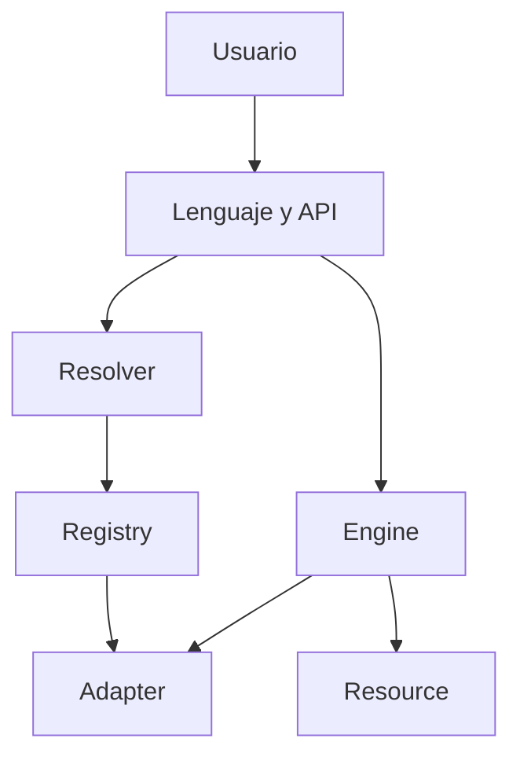

# Iter — Vista previa técnica

> **Vista previa, no distribución.** Iter todavía no está publicado en PyPI y este repositorio no contiene el código principal.

## La idea

**Aprende una vez. Usa cualquier biblioteca.**

Iter busca que el usuario exprese primero su intención. La resolución del formato, la biblioteca y el backend queda coordinada por el sistema.

## Abrir, convertir y exportar

```iter
data = iter open "data.json"
csv = iter convert data to "csv"
iter export csv as "data.csv"
```

El flujo conserva tres acciones claras:

1. abrir un recurso;
2. convertirlo;
3. exportarlo.

## Crear, guardar y abrir

```iter
project = iter create "data" {
    project: "Iter"
    status: "preview"
}

iter save project as "project.json"
result = iter open "project.json"
show result.data
```

Salida prevista:

```text
{project: "Iter", status: "preview"}
```

## Seleccionar una biblioteca o backend

```iter
iter use "pandas"
data = iter open "sales.csv"
summary = iter analyze data
show summary
```

El usuario indica qué quiere hacer. Iter debe resolver qué adaptador disponible puede ejecutarlo.

## Consultar el sistema

```iter
show iter about
show iter capabilities
show iter adapters
```

## Cómo funciona por dentro



| Componente | Responsabilidad |
|---|---|
| `Resource` | Representar archivos, datos y recursos web |
| `Resolver` | Identificar formatos, tipos y backends |
| `Registry` | Registrar y seleccionar adaptadores |
| `Adapter` | Ejecutar operaciones concretas |
| `Engine` | Coordinar el sistema |

## Qué busca reducir

- imports repetitivos en los ejemplos principales;
- configuración auxiliar antes de expresar la intención;
- nombres completamente distintos para operaciones equivalentes;
- selección manual de cada detalle del backend;
- código de integración duplicado.

## Operaciones previstas para la primera versión

| Área | Operaciones |
|---|---|
| Entrada y salida | `open`, `create`, `save`, `close` |
| Resolución | `resolve` |
| Búsqueda | `find`, `search` |
| Transformación | `convert`, `export` |
| Internet | `download`, `upload` |
| Gestión | `copy`, `move`, `rename`, `delete` |
| Colecciones | `list`, `count`, `filter` |
| Backend | `use`, `reset`, `current` |
| Diagnóstico | `about`, `capabilities`, `adapters`, `doctor` |

## Estado verificable

- **Versión candidata:** `0.3.0-rc.2`
- **Fase:** corrección de errores y validación privada
- **Código principal:** privado
- **Paquete oficial:** todavía no publicado
- **Contenido público actual:** concepto, sintaxis prevista y arquitectura

La sintaxis puede ajustarse antes del lanzamiento. Solo se anunciarán como disponibles las funciones implementadas y probadas.

## Lo que este repositorio no publica

- el código fuente completo;
- Iter Server;
- Iter Storage;
- credenciales, tokens o datos personales;
- herramientas internas;
- un paquete demostrativo o una instalación anticipada.

---

[Volver a la portada](README.md) · [Proponer una prioridad](https://github.com/Martinmanhue/iter-public/issues)

**Iter — Everything is a Resource.**
