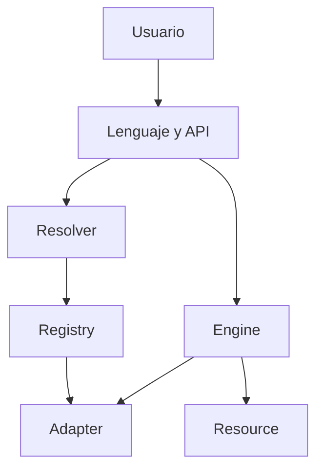

# Iter — Vista previa técnica

> **Vista previa, no distribución.** Iter todavía no está publicado en PyPI y este repositorio no contiene el código principal.

## La idea

**Aprende una vez. Usa cualquier biblioteca.**

Iter busca que el usuario exprese primero su intención. La resolución del formato, la biblioteca y el backend queda coordinada por el sistema.

## Convertir con una sola intención

```iter
iter convert data.json to data.csv
```

Para el usuario es una sola operación. Internamente, Iter debe:

1. localizar y abrir el recurso;
2. detectar el formato de entrada;
3. deducir el formato de salida;
4. seleccionar un adaptador compatible;
5. convertir, guardar y cerrar.

## Crear y guardar en una instrucción

```iter
iter create project.json {
    project: "Iter"
    status: "preview"
}
```

Iter deduce el formato por la extensión y guarda el recurso automáticamente.

## Backend automático, control opcional

La experiencia normal no exige escoger una biblioteca:

```iter
iter analyze sales.csv
```

Cuando el usuario necesita control explícito, puede indicarlo sin reconstruir el flujo:

```iter
iter analyze sales.csv with pandas
```

Iter selecciona automáticamente un adaptador compatible cuando el usuario no especifica uno.

## Consultar el sistema

```iter
iter info
iter capabilities
iter adapters
```

## Cómo funciona por dentro



| Componente | Responsabilidad |
|---|---|
| `Resource` | Representar archivos, datos y recursos web |
| `Resolver` | Identificar formatos, tipos y backends |
| `Registry` | Registrar y seleccionar adaptadores |
| `Adapter` | Ejecutar operaciones concretas |
| `Engine` | Coordinar el sistema |

## Principios de la experiencia

Iter busca ofrecer:

- una intención completa que normalmente quepa en una instrucción;
- formatos deducidos por nombres, extensiones y contexto;
- adaptador automático por defecto y selección manual opcional;
- errores explicados con lenguaje directo;
- consistencia entre operaciones equivalentes.

Iter busca evitar en los ejemplos principales:

- imports repetitivos;
- configuración auxiliar antes de expresar la intención;
- nombres completamente distintos para operaciones equivalentes;
- selección manual de cada detalle del backend;
- código de integración duplicado.

## Operaciones previstas para la primera versión

| Área | Operaciones |
|---|---|
| Entrada y salida | `open`, `create`, `save`, `close` |
| Resolución | `resolve` |
| Búsqueda | `find`, `search` |
| Transformación | `convert`, `export` |
| Internet | `download`, `upload` |
| Gestión | `copy`, `move`, `rename`, `delete` |
| Colecciones | `list`, `count`, `filter` |
| Backend | `use`, `reset`, `current` |
| Diagnóstico | `about`, `capabilities`, `adapters`, `doctor` |

## Estado verificable

- **Versión candidata:** `0.3.0-rc.2`
- **Fase:** corrección de errores y validación privada
- **Código principal:** privado
- **Paquete oficial:** todavía no publicado
- **Contenido público actual:** concepto, sintaxis prevista y arquitectura

La sintaxis puede ajustarse antes del lanzamiento. Solo se anunciarán como disponibles las funciones implementadas y probadas.

## Lo que este repositorio no publica

- el código fuente completo;
- Iter Server;
- Iter Storage;
- credenciales, tokens o datos personales;
- herramientas internas;
- un paquete demostrativo o una instalación anticipada.

---

[Volver a la portada](README.md) · [Consultar la hoja de ruta](ROADMAP.md) · [Proponer una prioridad](https://github.com/Martinmanhue/iter-public/issues/1)

**Iter — Everything is a Resource.**
