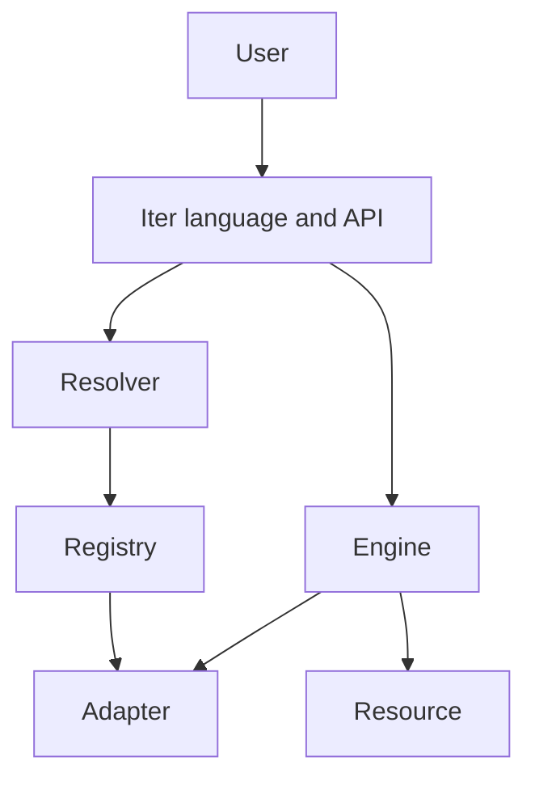

<div align="center">


# ITER

### Learn once. Use any library.

**A common experience for working with resources, formats, libraries, and backends.**

[](ITER_PREVIEW.md)
[](#current-status)
[](https://github.com/Martinmanhue/iter-public/stargazers)

[Español](README.md) · [Technical preview](ITER_PREVIEW.md) · [Roadmap](ROADMAP.md) · [Press kit](PRESS_KIT.md)

⭐ **Star the repository to follow Iter's development and launch.**

</div>

---

## What is Iter?

Iter is a proposal for expressing common operations through one consistent interface.

Opening data, converting formats, or switching libraries often means learning different APIs, repeating integrations, and rewriting parts of a workflow. Iter aims to reduce that friction so the user can focus on intent.

```iter
iter convert data.json to data.csv
```

The idea is simple:

- the user states **what they want to obtain**;
- Iter determines **how** to coordinate compatible formats, adapters, and backends;
- the workflow preserves its meaning even when the underlying tool changes.

> These examples describe the intended experience. Iter is not yet available on PyPI, and this repository does not contain the private core implementation.

## Why it may matter

| Today | With Iter |
|---|---|
| A different interface for every tool | One common way to express intent |
| Repeated integration work | Reusable adapters |
| Formats and backends handled manually | Coordinated resolution |
| Changing tools means rewriting workflows | Workflow meaning is preserved |

## Example experience

```iter
iter create report.json {
    name: "Iter"
    stage: "preview"
}
```

- The format is inferred from `.json`.
- Simple operations do not require visible imports.
- Intent is expressed first; infrastructure is coordinated afterward.

## Public-preview pillars

- **Unify:** one common way to work with resources and operations.
- **Connect:** link formats, libraries, and backends through adapters.
- **Simplify:** reduce friction, repetition, and manual integration.
- **Scale:** preserve workflow intent as implementations change.

## Architecture



- **Resource:** common representation for files, data, and web resources.
- **Resolver:** identifies formats, types, and backends.
- **Registry:** registers and selects adapters.
- **Adapter:** executes concrete operations.
- **Engine:** coordinates the workflow.

## Planned first-version areas

| Area | Planned operations |
|---|---|
| Input and output | `open`, `create`, `save`, `close` |
| Resolution | `resolve` |
| Search | `find`, `search` |
| Transformation | `convert`, `export` |
| Internet | `download`, `upload` |
| Management | `copy`, `move`, `rename`, `delete` |
| Collections | `list`, `count`, `filter` |
| Backend | `use`, `reset`, `current` |
| Diagnostics | `about`, `capabilities`, `adapters`, `doctor` |

## Current status

- **Release candidate:** `0.3.0-rc.2`
- **Phase:** bug fixing and private validation
- **Core code:** private
- **PyPI:** no official distribution yet
- **This repository:** public presentation, documentation, and preview—not the complete Iter system

Only implemented and verified functions will be announced as available.

## How to follow Iter

1. ⭐ Star the repository.
2. Read the [technical preview](ITER_PREVIEW.md).
3. Review the [public roadmap](ROADMAP.md).
4. Share feedback in [What should Iter unify first?](https://github.com/Martinmanhue/iter-public/issues/1).

---

<div align="center">

**Iter — Everything is a Resource.**

Public preview · Launch coming later

</div>
