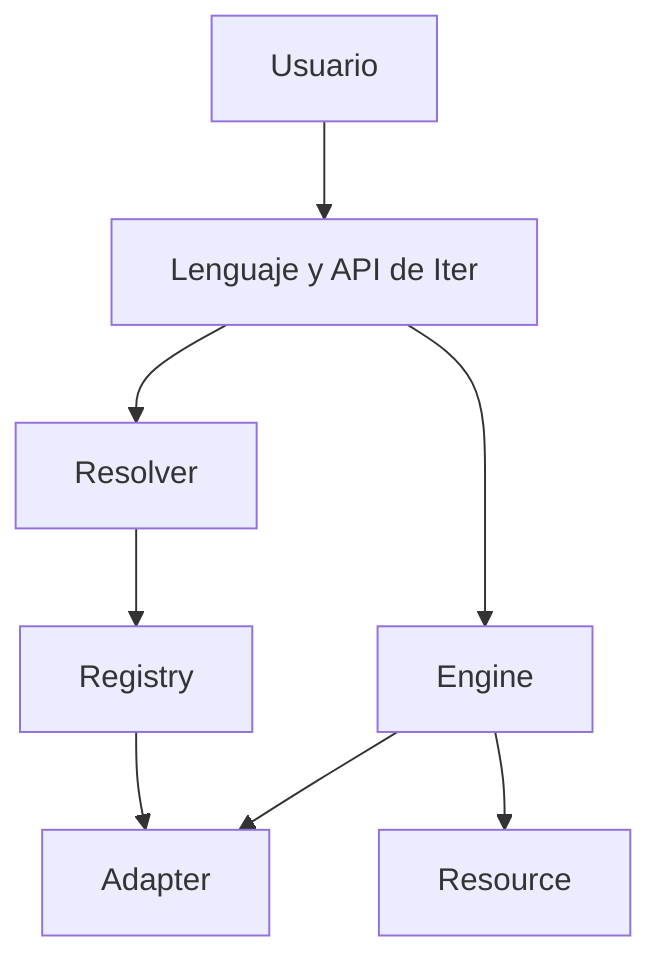

<div align="center">

# ITER

### Aprende una vez. Usa cualquier biblioteca.

**Una experiencia común para trabajar con recursos, formatos, bibliotecas y backends.**

[](ITER_PREVIEW.md)
[](#estado-actual)
[](https://github.com/Martinmanhue/iter-public/stargazers)

[Ver la vista previa](ITER_PREVIEW.md) · [Comentar una prioridad](https://github.com/Martinmanhue/iter-public/issues) · [Compartir Iter](SHARE_ITER.md)

⭐ **Si la idea te parece útil, marca `Star` para seguir el lanzamiento.**

</div>

---

## El problema

Abrir datos, convertir formatos o cambiar de biblioteca suele exigir aprender una interfaz diferente y repetir código de integración.

Iter propone comenzar por la intención del usuario:

```iter
data = iter open "data.json"
csv = iter convert data to "csv"
iter export csv as "data.csv"
```

**Abrir. Convertir. Exportar.** Iter debe resolver el recurso, el formato y el adaptador compatible.

> Los ejemplos muestran la experiencia prevista para el lanzamiento. Iter todavía no está disponible en PyPI.

## Una forma común de trabajar

```iter
project = iter create "data" {
    project: "Iter"
    status: "release-candidate"
}

iter save project as "project.json"
result = iter open "project.json"
show result.data
```

Sin imports visibles ni configuración auxiliar en el flujo principal.

## Qué cambia

| Hoy | Con Iter |
|---|---|
| Una interfaz distinta por herramienta | Una forma común de expresar intenciones |
| Integraciones repetidas | Adaptadores reutilizables |
| Formatos y backends resueltos manualmente | Resolución coordinada |
| Cambiar de herramienta rehace el flujo | El significado del flujo se conserva |

## Arquitectura



- **Resource:** representación común de archivos, datos y recursos web.
- **Resolver:** identifica formatos, tipos y backends.
- **Registry:** registra y selecciona adaptadores.
- **Adapter:** ejecuta operaciones concretas.
- **Engine:** coordina el flujo.

## Áreas de la primera versión

| Área | Operaciones previstas |
|---|---|
| Entrada y salida | `open`, `create`, `save`, `close` |
| Búsqueda | `find`, `search` |
| Transformación | `convert`, `export` |
| Gestión | `copy`, `move`, `rename`, `delete` |
| Colecciones | `list`, `count`, `filter` |
| Backend | `use`, `reset`, `current` |
| Diagnóstico | `about`, `capabilities`, `adapters`, `doctor` |

## Estado actual

- **Versión candidata:** `0.3.0-rc.2`
- **Fase:** corrección de errores y validación privada
- **Código principal:** privado
- **PyPI:** todavía no existe una distribución oficial
- **Este repositorio:** presentación y vista previa técnica; no contiene Iter completo

Solo se anunciarán como disponibles las funciones que hayan sido implementadas y verificadas.

## Qué permanece privado

- el código fuente completo;
- Iter Server;
- Iter Storage;
- pruebas y herramientas internas;
- credenciales, tokens o información personal;
- funciones todavía no verificadas.

## Participa

1. ⭐ Marca **Star** para seguir el lanzamiento.
2. Lee la [vista previa técnica](ITER_PREVIEW.md).
3. Abre un [issue](https://github.com/Martinmanhue/iter-public/issues) con la biblioteca, el formato o el backend que te gustaría ver primero.

---

<div align="center">

**Iter — Everything is a Resource.**

Vista previa pública · Lanzamiento próximamente

</div>
