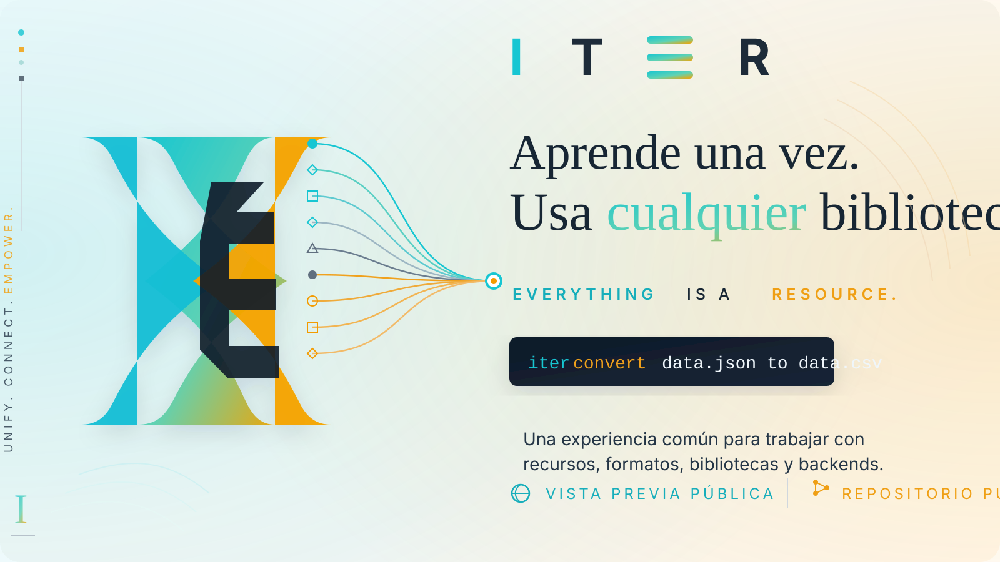
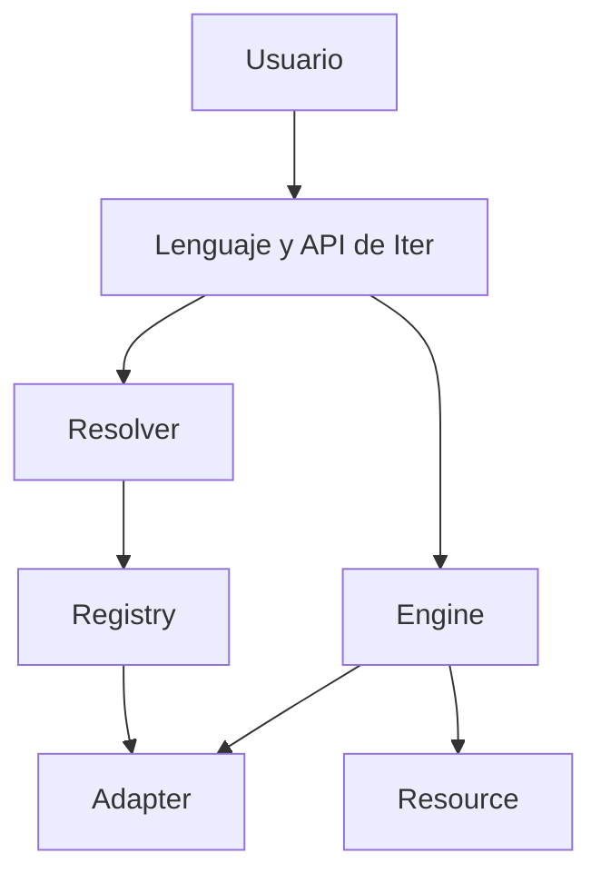

<div align="center">



# ITER

### Aprende una vez. Usa cualquier biblioteca.

**Una experiencia común para trabajar con recursos, formatos, bibliotecas y backends.**

[](ITER_PREVIEW.md)
[](#estado-actual)
[](https://github.com/Martinmanhue/iter-public/stargazers)

[English](README.en.md) · [Ver la vista previa](ITER_PREVIEW.md) · [Hoja de ruta](ROADMAP.md) · [Plan de lanzamiento](LANZAMIENTO_PUBLICO.md) · [Kit de presentación](PRESS_KIT.md)

⭐ **Marca `Star` para seguir el lanzamiento de Iter.**

</div>

---

## Qué es Iter

Iter es una propuesta para expresar operaciones comunes con una sola interfaz.

Abrir datos, convertir formatos o cambiar de biblioteca suele obligar a aprender APIs distintas, repetir integraciones y reescribir partes del flujo. Iter busca reducir esa fricción para que el usuario se concentre en la intención.

```iter
iter convert data.json to data.csv
```

La idea es simple:

- el usuario indica **qué quiere obtener**;
- Iter resuelve **cómo** coordinar formatos, adaptadores y backends compatibles;
- el flujo conserva el significado aunque cambie la herramienta subyacente.

> Estos ejemplos muestran la experiencia prevista. Iter todavía no está disponible en PyPI y este repositorio no contiene el código principal.

## Por qué puede importar

| Hoy | Con Iter |
|---|---|
| Una interfaz distinta por herramienta | Una forma común de expresar intenciones |
| Integraciones repetidas | Adaptadores reutilizables |
| Formatos y backends resueltos manualmente | Resolución coordinada |
| Cambiar de herramienta rehace el flujo | El significado del flujo se conserva |

## Un ejemplo de experiencia

```iter
iter create report.json {
    name: "Iter"
    stage: "preview"
}
```

- El formato se deduce de `.json`.
- No hacen falta imports visibles para operaciones sencillas.
- La intención se expresa primero; la infraestructura se coordina después.

## Pilares de la vista previa pública

- **Unifica:** una forma común de trabajar con recursos y operaciones.
- **Conecta:** enlaza formatos, bibliotecas y backends mediante adaptadores.
- **Simplifica:** reduce fricción, repeticiones e integración manual.
- **Escala:** conserva la intención del flujo aunque cambie la implementación.

## Arquitectura



- **Resource:** representación común de archivos, datos y recursos web.
- **Resolver:** identifica formatos, tipos y backends.
- **Registry:** registra y selecciona adaptadores.
- **Adapter:** ejecuta operaciones concretas.
- **Engine:** coordina el flujo.

## Áreas previstas para la primera versión

| Área | Operaciones previstas |
|---|---|
| Entrada y salida | `open`, `create`, `save`, `close` |
| Resolución | `resolve` |
| Búsqueda | `find`, `search` |
| Transformación | `convert`, `export` |
| Internet | `download`, `upload` |
| Gestión | `copy`, `move`, `rename`, `delete` |
| Colecciones | `list`, `count`, `filter` |
| Backend | `use`, `reset`, `current` |
| Diagnóstico | `about`, `capabilities`, `adapters`, `doctor` |

## Estado actual

- **Versión candidata:** `0.3.0-rc.2`
- **Fase:** corrección de errores y validación privada
- **Código principal:** privado
- **PyPI:** todavía no existe una distribución oficial
- **Este repositorio:** presentación, documentación y vista previa; no contiene Iter completo

Solo se anunciarán como disponibles las funciones implementadas y verificadas.

## Qué permanece privado

- el código fuente completo;
- Iter Server;
- Iter Storage;
- pruebas y herramientas internas;
- credenciales, tokens o información personal;
- funciones todavía no verificadas.

## Cómo seguir Iter

1. ⭐ Marca **Star** para seguir el proyecto.
2. Lee la [vista previa técnica](ITER_PREVIEW.md).
3. Consulta la [hoja de ruta pública](ROADMAP.md).
4. Usa los [mensajes para compartir](SHARE_ITER.md) si quieres presentarlo.
5. Sigue el [plan de lanzamiento público](LANZAMIENTO_PUBLICO.md).
6. Revisa el [kit de presentación](PRESS_KIT.md) para una explicación breve y reutilizable.
7. Responde al issue [¿Qué debería unificar Iter primero?](https://github.com/Martinmanhue/iter-public/issues/1).

## Documentación pública

- [Vista previa técnica](ITER_PREVIEW.md)
- [Hoja de ruta](ROADMAP.md)
- [Política de seguridad](SECURITY.md)
- [Colaboración y comentarios](CONTRIBUYENDO.md)
- [Mensajes para compartir](SHARE_ITER.md)
- [Plan de lanzamiento público](LANZAMIENTO_PUBLICO.md)
- [Kit de presentación](PRESS_KIT.md)
- [Licencia de la vista previa](LICENSE)

---

<div align="center">

**Iter — Everything is a Resource.**

Vista previa pública · Lanzamiento próximamente

</div>
