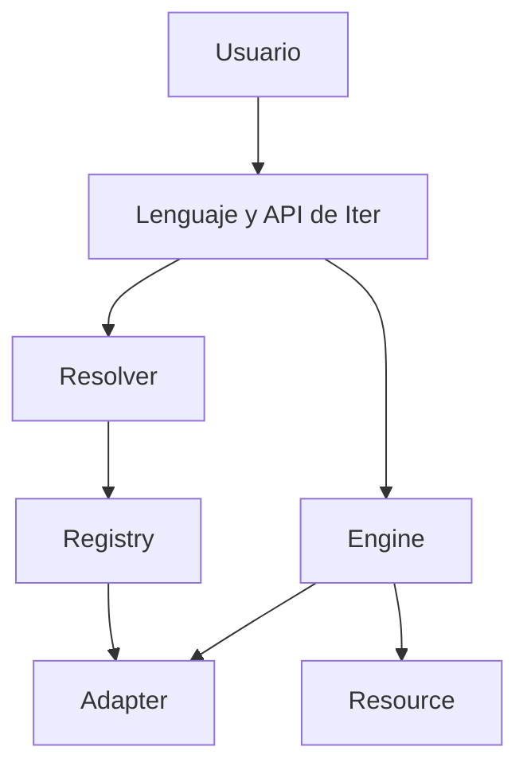

<div align="center">


# ITER

### Aprende una vez. Usa cualquier biblioteca.

**Una experiencia común para trabajar con recursos, formatos, bibliotecas y backends.**

[](ITER_PREVIEW.md)
[](#estado-actual)
[](https://github.com/Martinmanhue/iter-public/stargazers)

[Ver la vista previa](ITER_PREVIEW.md) · [Consultar la hoja de ruta](ROADMAP.md) · [Comentar una prioridad](https://github.com/Martinmanhue/iter-public/issues/1) · [Compartir Iter](SHARE_ITER.md)

⭐ **Marca `Star` para seguir el lanzamiento de Iter.**

</div>

---

## El problema

Abrir datos, convertir formatos o cambiar de biblioteca suele exigir aprender una interfaz diferente y repetir código de integración.

Iter propone expresar la intención completa en una sola instrucción:

```iter
iter convert data.json to data.csv
```

El usuario indica **qué quiere obtener**. Iter debe abrir el recurso, detectar los formatos, seleccionar un adaptador compatible, convertir, guardar y cerrar de manera coordinada.

> Estos ejemplos muestran la experiencia prevista. Iter todavía no está disponible en PyPI y este repositorio no contiene el código principal.

## Una intención, una instrucción

```iter
iter create project.json {
    project: "Iter"
    status: "release-candidate"
}
```

El formato se deduce de `.json`. No hacen falta imports visibles, rutas temporales, variables intermedias ni una orden separada para guardar.

Cuando el usuario necesite controlar un detalle, podrá indicarlo. Cuando no lo indique, Iter seleccionará una opción compatible automáticamente.

## Qué busca cambiar

| Hoy | Con Iter |
|---|---|
| Una interfaz distinta por herramienta | Una forma común de expresar intenciones |
| Integraciones repetidas | Adaptadores reutilizables |
| Formatos y backends resueltos manualmente | Resolución coordinada |
| Cambiar de herramienta rehace el flujo | El significado del flujo se conserva |

## Arquitectura



- **Resource:** representación común de archivos, datos y recursos web.
- **Resolver:** identifica formatos, tipos y backends.
- **Registry:** registra y selecciona adaptadores.
- **Adapter:** ejecuta operaciones concretas.
- **Engine:** coordina el flujo.

## Áreas de la primera versión

| Área | Operaciones previstas |
|---|---|
| Entrada y salida | `open`, `create`, `save`, `close` |
| Resolución | `resolve` |
| Búsqueda | `find`, `search` |
| Transformación | `convert`, `export` |
| Internet | `download`, `upload` |
| Gestión | `copy`, `move`, `rename`, `delete` |
| Colecciones | `list`, `count`, `filter` |
| Backend | `use`, `reset`, `current` |
| Diagnóstico | `about`, `capabilities`, `adapters`, `doctor` |

## Estado actual

- **Versión candidata:** `0.3.0-rc.2`
- **Fase:** corrección de errores y validación privada
- **Código principal:** privado
- **PyPI:** todavía no existe una distribución oficial
- **Este repositorio:** presentación, documentación y vista previa; no contiene Iter completo

Solo se anunciarán como disponibles las funciones implementadas y verificadas.

## Qué permanece privado

- el código fuente completo;
- Iter Server;
- Iter Storage;
- pruebas y herramientas internas;
- credenciales, tokens o información personal;
- funciones todavía no verificadas.

## Participa

1. ⭐ Marca **Star** para seguir el lanzamiento.
2. Lee la [vista previa técnica](ITER_PREVIEW.md).
3. Consulta la [hoja de ruta pública](ROADMAP.md).
4. Responde al issue [¿Qué debería unificar Iter primero?](https://github.com/Martinmanhue/iter-public/issues/1).

## Documentación pública

- [Vista previa técnica](ITER_PREVIEW.md)
- [Hoja de ruta](ROADMAP.md)
- [Política de seguridad](SECURITY.md)
- [Colaboración y comentarios](CONTRIBUTING.md)
- [Mensajes para compartir](SHARE_ITER.md)
- [Licencia de la vista previa](LICENSE)

---

<div align="center">

**Iter — Everything is a Resource.**

Vista previa pública · Lanzamiento próximamente

</div>
